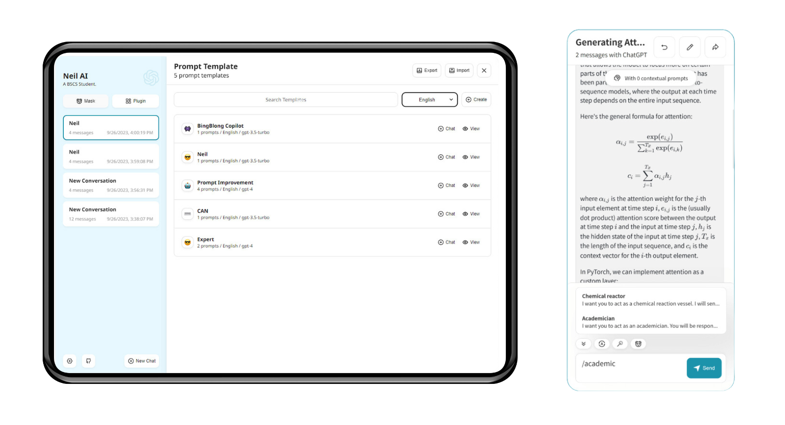

<div align="center">


<h1 align="center">ChatGPT Next Web</h1>

English 

One-Click to get well-designed cross-platform ChatGPT.

 ChatGPT 

[![Web][Web-image]][web-url]
[![Windows][Windows-image]][download-url]
[![MacOS][MacOS-image]][download-url]
[![Linux][Linux-image]][download-url]

[Web App](https://chat.neilswing.com/) / [Discord](https://discord.gg) / [Twitter](https://twitter.com) / [Buy Me a Coffee](https://www.buymeacoffee.com/neilswing)

[web-url]: https://chat.neilswing.com/
[download-url]: https://github.com/neilswing
[Web-image]: https://img.shields.io/badge/Web-PWA-orange?logo=microsoftedge
[Windows-image]: https://img.shields.io/badge/-Windows-blue?logo=windows
[MacOS-image]: https://img.shields.io/badge/-MacOS-black?logo=apple
[Linux-image]: https://img.shields.io/badge/-Linux-333?logo=ubuntu


[](https://gitpod.io/#https://github.com/neilswing/ChatGPT-Next-Web)



</div>

## Features

- **Deploy for free with one-click** on Vercel in under 1 minute
- Compact client (~5MB) on Linux/Windows/MacOS, [download it now](https://github.com/neilswing/ChatGPT-Next-Web/)
- Fully compatible with self-deployed llms, recommended for use with [RWKV-Runner](https://github.com/josStorer/RWKV-Runner) or [LocalAI](https://github.com/go-skynet/LocalAI)
- Privacy first, all data stored locally in the browser
- Markdown support: LaTex, mermaid, code highlight, etc.
- Responsive design, dark mode and PWA
- Fast first screen loading speed (~100kb), support streaming response
- New in v2: create, share and debug your chat tools with prompt templates (mask)
- Awesome prompts powered by [awesome-chatgpt-prompts-zh](https://github.com/PlexPt/awesome-chatgpt-prompts-zh) and [awesome-chatgpt-prompts](https://github.com/f/awesome-chatgpt-prompts)
- Automatically compresses chat history to support long conversations while also saving your tokens
- I18n: English, 简体中文, 繁体中文, 日本語, Français, Español, Italiano, Türkçe, Deutsch, Tiếng Việt, Русский, Čeština, 한국어, Indonesia

## Roadmap

- [x] System Prompt: pin a user defined prompt as system prompt 
- [x] User Prompt: user can edit and save custom prompts to prompt list
- [x] Prompt Template: create a new chat with pre-defined in-context prompts 
- [x] Share as image, share to ShareGPT 
- [x] Desktop App with tauri
- [x] Self-host Model: Fully compatible with [RWKV-Runner](https://github.com/josStorer/RWKV-Runner), as well as server deployment of [LocalAI](https://github.com/go-skynet/LocalAI): llama/gpt4all/rwkv/vicuna/koala/gpt4all-j/cerebras/falcon/dolly etc.
- [ ] Plugins: support network search, calculator, any other apis etc. 

## What's New

- 🚀 v2.0 is released, now you can create prompt templates, turn your ideas into reality! Read this: [ChatGPT Prompt Engineering Tips: Zero, One and Few Shot Prompting](https://www.allabtai.com/prompt-engineering-tips-zero-one-and-few-shot-prompting/).
- 🚀 v2.7 let's share conversations as image, or share to ShareGPT!
- 🚀 v2.8 now we have a client that runs across all platforms!

## Get Started

> 

1. Get [OpenAI API Key](https://platform.openai.com/account/api-keys);
2. Enjoy :)

## FAQ

[English > FAQ](./docs/faq-en.md)

## Keep Updated

> 

If you have deployed your own project with just one click following the steps above, you may encounter the issue of "Updates Available" constantly showing up. This is because Vercel will create a new project for you by default instead of forking this project, resulting in the inability to detect updates correctly.

We recommend that you follow the steps below to re-deploy:

- Delete the original repository;
- Use the fork button in the upper right corner of the page to fork this project;
- Choose and deploy in Vercel again, 

### Enable Automatic Updates

> If you encounter a failure of Upstream Sync execution, please manually sync fork once.

After forking the project, due to the limitations imposed by GitHub, you need to manually enable Workflows and Upstream Sync Action on the Actions page of the forked project. Once enabled, automatic updates will be scheduled every hour:

### Manually Updating Code

If you want to update instantly, you can check out the [GitHub documentation](https://docs.github.com/en/pull-requests/collaborating-with-pull-requests/working-with-forks/syncing-a-fork) to learn how to synchronize a forked project with upstream code.

You can star or watch this project or follow author to get release notifications in time.

## Access Password

>

This project provides limited access control. Please add an environment variable named `CODE` on the vercel environment variables page. The value should be passwords separated by comma like this:

```
code1,code2,code3
```

After adding or modifying this environment variable, please redeploy the project for the changes to take effect.

## Environment Variables

> 

### `OPENAI_API_KEY` (required)

Your openai api key.

### `CODE` (optional)

Access passsword, separated by comma.

### `BASE_URL` (optional)

> Default: `https://api.openai.com`

> Examples: `http://your-openai-proxy.com`

Override openai api request base url.

### `OPENAI_ORG_ID` (optional)

Specify OpenAI organization ID.

### `HIDE_USER_API_KEY` (optional)

> Default: Empty

If you do not want users to input their own API key, set this value to 1.

### `DISABLE_GPT4` (optional)

> Default: Empty

If you do not want users to use GPT-4, set this value to 1.

### `HIDE_BALANCE_QUERY` (optional)

> Default: Empty

If you do not want users to query balance, set this value to 1.

## Requirements

NodeJS >= 18, Docker >= 20

## Development

> 

[](https://gitpod.io/#https://github.com/neilswing/ChatGPT-Next-Web)

Before starting development, you must create a new `.env.local` file at project root, and place your api key into it:

```
OPENAI_API_KEY=<your api key here>

# if you are not able to access openai service, use this BASE_URL
BASE_URL=https://chatgpt1.nextweb.fun/api/proxy
```

### Local Development

```shell
# 1. install nodejs and yarn first
# 2. config local env vars in `.env.local`
# 3. run
yarn install
yarn dev
```

## Deployment

>

### Docker (Recommended)

```shell
docker pull yidadaa/chatgpt-next-web

docker run -d -p 3000:3000 \
   -e OPENAI_API_KEY=sk-xxxx \
   -e CODE=your-password \
   yidadaa/chatgpt-next-web
```

You can start service behind a proxy:

```shell
docker run -d -p 3000:3000 \
   -e OPENAI_API_KEY=sk-xxxx \
   -e CODE=your-password \
   -e PROXY_URL=http://localhost:7890 \
   yidadaa/chatgpt-next-web
```

If your proxy needs password, use:

```shell
-e PROXY_URL="http://127.0.0.1:7890 user pass"
```

## Documentation

> Please go to the [docs][./docs] directory for more documentation instructions.

- [Deploy with cloudflare (Deprecated)](./docs/cloudflare-pages-en.md)
- [Frequent Ask Questions](./docs/faq-en.md)
- [How to add a new translation](./docs/translation.md)


## Screenshots


## Translation

If you want to add a new translation, read this [document](./docs/translation.md).

## Donation

[Buy Me a Coffee](https://www.buymeacoffee.com/neilswing)


## LICENSE

[MIT](https://opensource.org/license/mit/)
